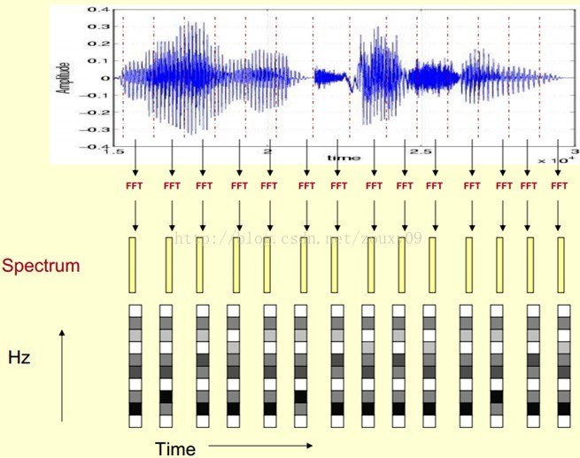

# 12.26 - 1.3 学习报告

### 知识学习：

1. 人体声音发出 - 人体声音接受 大致身体构造原理
2.  **声谱图**[1]  ——　描述语音信号，一段语音分为多帧，每帧语音对应一个频谱（短时FFT计算），　频谱表示了频率与能量的关系，并对频谱转化为灰度级表示（幅度值越大，相应的区域越黑） 最终得到**描述语音信号的spectrogram声谱图**  （更好的观察音素和共振峰，可用于隐马尔可夫模型）

3. 共振峰（formants）： 第一泛音，或第二泛音，见维基百科
4. **倒谱分析 ** :   提取共振峰的频谱包络

参考文献： 1、 [语音信号处理之（四）梅尔频率倒谱系数（MFCC）](https://blog.csdn.net/zouxy09/article/details/9156785)

